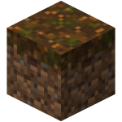

# Podzol
**A fallback server for minecraft**

but here is a nice image of the podzol block

## Installation
Podzol is a node module and therefore requires Node.js installed.
Podzol itself can be installed via terminal easily.

**Step 1:** Install Node.js

**Step 2:**
`npm install podzol -g`

## Usage
Podzol is a command line application. It provides the command `podzol` *Who would have guessed that?* and various subcommands.

### Starting server
Type `podzol start` to start the server. 
Note that the actual server is detatched from terminal and runs in the background, which means you can close the terminal session.

Running two servers at the same time is not possible.

### Stopping server
Type `podzol stop` to stop the server.

### Displaying version
